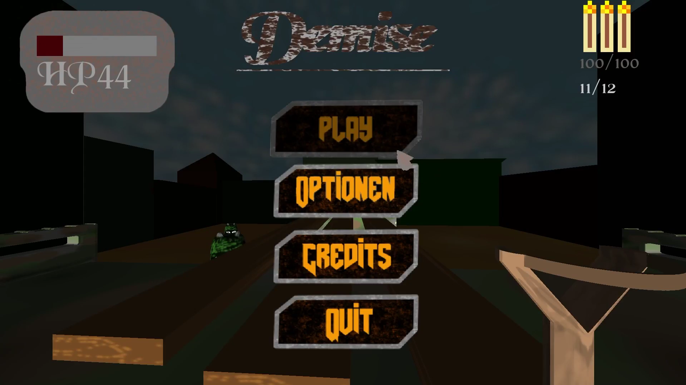
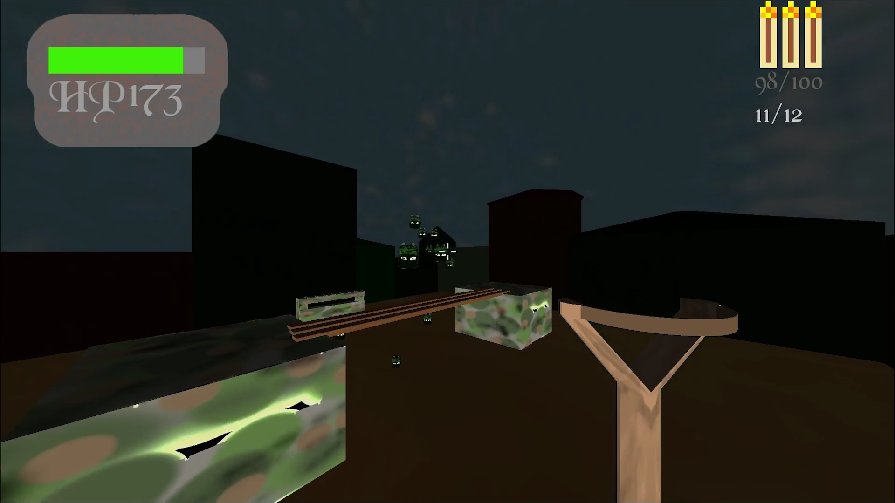
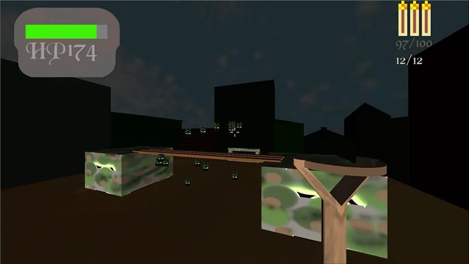

# DEMISE

DEMISE is a 3D shooter built with Python, Pygame, and PyOpenGL. The graphics and player view was inspired by Doom. The player fights through waves of enemies, manages weapons, and tries to survive as long as possible.

It was build for our school project 2024/25 where we got 2nd place. 

All the graphic you see in the game was made by us or Vladimir Kandalintsev

Link to the competition: [ Htl Bau Informatik Design - pgc25 ](https://www.htl-ibk.at/pgc25-21-gewinner-und-3-praemierte/#gallery-2)

**Status:** Archived

<br>

## Credits

**Programming:**  
Alexander Sief & Simon Schober

**Graphics:**  
Vladimir Kandalintsev

**Sound:**  
Simon Schober

<br>

## Screenshots

### Start screen


<br>

### While Playing


<br>



---

## How to play:

### Windows:
1. Download the Repo:
```
git clone https://github.com/Alexius2408/DEMISE.git
cd ./Demise
```

2. Install Python version 3.11:
```
py install 3.11
```

3. Make a venv and install the requirements.txt:
```
py -3.11 -m venv .venv
.\.venv\Scripts\activate
pip install --upgrade pip
pip install -r .\requirements.txt
```

4. Run the main.py and enjoy:
```
py ./src/demise/main.py
```
